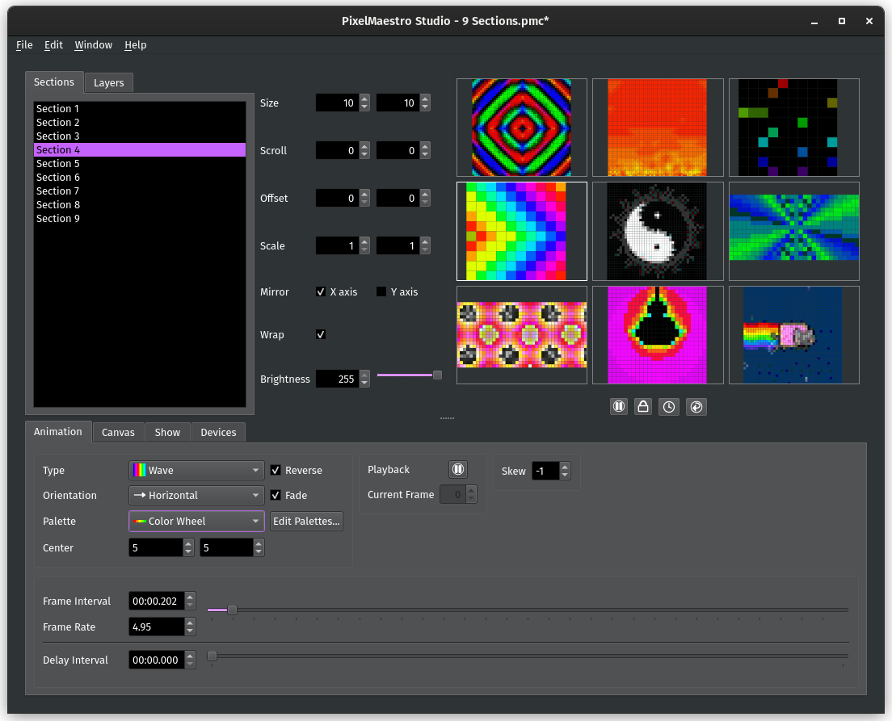

# PixelMaestro Studio

 

PixelMaestro Studio is a desktop application for controlling LED displays using the [PixelMaestro library](https://github.com/8bitbuddhist/PixelMaestro). Using PixelMaestro Studio, you can create custom LED animations, save and load presets, and control LEDs over USB.



## Features

- Design rich, full color animations using interactive real-time visual editing tools
- Create time-based animations and transitions using an intuitive event scheduling system
- Upload your changes in real-time to Arduino and other devices over USB
- Save, load, and share your custom animations and configurations

## Usage

Download the latest version of PixelMaestro Studio from the [Releases](https://github.com/8bitbuddhist/PixelMaestro-Studio/releases) page. The [documentation](https://8bitbuddhist.github.io/PixelMaestro-Studio/) explains how to use PixelMaestro Studio and its various features.

To learn more about the PixelMaestro library itself, [visit the repository](https://github.com/8bitbuddhist/PixelMaestro/) or check out the [documentation](https://8bitbuddhist.github.io/PixelMaestro/).

## Running PixelMaestro Studio

Download the latest version of PixelMaestro Studio from the [releases](https://github.com/8bitbuddhist/PixelMaestro-Studio/releases/) page.

### Windows

Download and run `PixelMaestro_Studio.exe`.

### Linux

Download and run `PixelMaestro_Studio`:

```bash
$ wget https://github.com/8bitbuddhist/PixelMaestro-Studio/releases/download/{version tag}/PixelMaestro_Studio
$ chmod +x PixelMaestro_Studio
$ ./PixelMaestro_Studio
```

## Building PixelMaestro Studio

### Build Requirements
- QT 5.12.3 or higher with the QtSerialPort module
- [PixelMaestro core library](https://github.com/8bitbuddhist/PixelMaestro) (included as a submodule)

### Build Instructions (Linux)
1. [Download and install Qt](https://www.qt.io/download) along with the QtSerialPort module.
2. Clone the GitHub repository to your computer:
	- `git clone https://github.com/8bitbuddhist/PixelMaestro-Studio.git`
3. Navigate to the newly created repository folder and use `git submodule` to download the PixelMaestro core library:
	```bash
	$ cd PixelMaestro-Studio
	$ git submodule init
	$ git submodule update
	```
4. Use `qmake` to build the project, or if you have Qt Creator installed, open the `PixelMaestro_Studio.pro` file.
	```bash
	qmake PixelMaestro-Studio.pro && make qmake_all
	```

### Building Static Qt

When creating a static build of Qt 5.12.x, `make` might fails with a "bootstrap-private" error. [See this StackOverflow answer for details](https://forum.qt.io/topic/98501/static-compile-error-qt5-12-0-bootstrap-private/8)

To fix this, install the following libs:

```bash
sudo apt install libxkbcommon-dev
sudo apt install '^libxcb.*-dev' libx11-xcb-dev libglu1-mesa-dev libxrender-dev libxi-dev
```

Then, clone the Qt Git sources and create a shadow build:

```bash
$ git clone https://code.qt.io/qt/qt5.git   // This should also work with Qt sources downloaded from the installer
$ cd qt5
$ mkdir build               // shadow build location
$ mkdir install             // where the static Qt libs will be installed
$ cd build
$ ../configure -static -release -prefix ../install -opensource --confirm-license -skip webengine -nomake tests -nomake examples -nomake tools -system-xcb -recheck-all
$ make -j3                  // -j param specifies the number of cores
$ make install              // Compiled static Qt libs will be placed in the install dir
```

## Credits

Icons based on the [Monochrome icon set by Danny Allen](https://store.kde.org/p/1002558), retrieved from [Openclipart](https://openclipart.org/).
