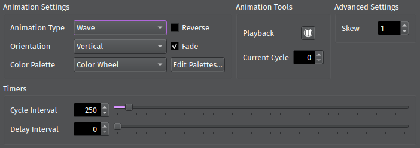
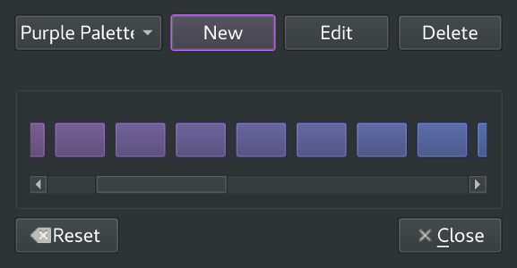
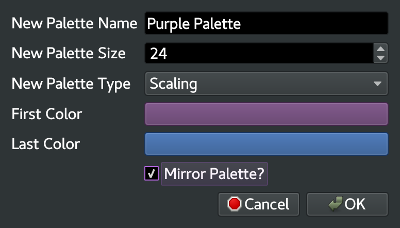

Animation Tab
=============

The Animation tab is where you can create and modify :pmdocs:`Animations <Animations.html>`. Here you can enable Animations, change the type of Animation, create a color palette, and configure the Animation. Selecting certain Animations will cause additional controls to appear, letting you change parameters specific to that Animation.

Choosing an Animation
---------------------

Select an Animation using the *Animation Type* drop-down. For all Animation types, you can modify basic options such as:

* *Orientation*\ : Which direction the Animation moves in.
* *Reverse*\ : Whether to run the Animation forwards or in reverse.
* *Fade*\ : Whether to gradually transition between colors or jump from one color to the next.

.. Note:: Not all Animations support the same options.

The *Color Palette* drop-down lets you select the color palette used to draw the Animation. Continue reading to learn more about customizing Palettes.

.. Tip:: To reapply a Palette after customizing it, simply reselect it from the drop-down.

The *Center* controls let you change the location where the Animation is centered on the grid. This only applies to specific Animations, such as ``Radial`` and ``Mandelbrot``.

Setting Timers
--------------

*Cycle Interval* sets the amount of time (in milliseconds) between Animation cycles. A cycle is the amount of time required for each pixel to change from one color to the next. For example, a Blink Animation has two cycles: one to turn each pixel off, and one to set each pixel back to its initial color. A Blink Animation with a cycle interval of 1000 means the animation takes 2 seconds to complete: 1 second to turn off, and 1 more second to turn back on.

*Delay Interval* sets the amount of time (in milliseconds) to wait before starting a new cycle. For example, if a Blink Animation has a delay interval of 2000, then the animation will pause for 2 full seconds at the end of each cycle before starting the next cycle. This is only available while fading is enabled.

Controlling Playback
--------------------

The ``Animation Tools`` group box lets you start and stop Animation playback. If the Animation is paused, you can skip to a specific cycle by entering the cycle number in the ``Current Cycle`` text box.

Customizing Color Palettes
--------------------------

The Palette Editor lets you create your own custom :pmdocs:`color palettes <Palettes.html>` or modify existing palettes. To open it, click *Edit Palettes...*

Creating a New Palette
^^^^^^^^^^^^^^^^^^^^^^

To create a new palette, click *New Palette*. Enter a name for the new palette, the number of colors in the palette, and the type of palette:

* **Blank** creates a palette where all colors are black.
* **Random** creates a palette where each color is randomly generated.
* **Scaling** creates a palette that gradually scales from the *first color* to the *last color*. Select *Mirror* to scale from the first color to the last color, then back to the first color. This is useful for seamlessly blending Animations from one cycle to the next.

Click *OK* to generate and save your new palette.

Selecting and Editing a Palette
^^^^^^^^^^^^^^^^^^^^^^^^^^^^^^^

The drop-down in the top left corner lists all available palettes. Selecting a palette displays each of its colors. You can change any color by clicking on it and selecting a new color from the popup dialog. Clicking the *Edit* button lets you change the palette's name, size, or color scheme.

You can also delete a palette by selecting it and clicking *Delete*. This won't affect any Maestro components that are currently using the palette unless you re-select the Palette from the drop-down.

Resetting Palettes
^^^^^^^^^^^^^^^^^^

To revert back to the default settings, click the *Reset* button. This will remove all customizations and restore the default palette set.
