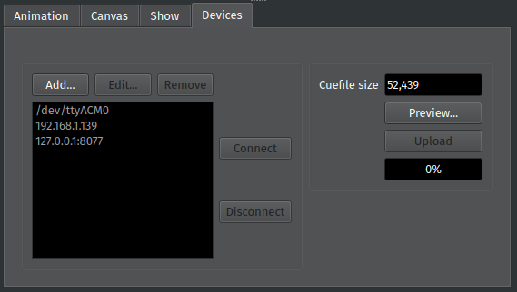
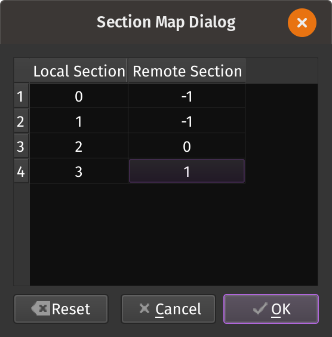

Device Tab
==========

The Device Tab lets you connect PixelMaestro Studio to devices over serial, USB, or TCP. This lets you send commands to devices that interact directly with LED hardware, such as an Arduino.

Your device must be running a sketch capable of receiving and interpreting serial commands from PixelMaestro Studio. You can find samples in the :pmarduino:`PixelMaestro Arduino folder <>`.

Adding a Device
---------------

To add a new device, click the *Add* button. This opens the new device dialog. If connecting to a serial device, you can use the drop-down to view a list of serial devices connected to your PC. You can also type in the port that the device is connected to directly.

If connecting to a network device, enter the IP address (and optionally, the port number) of the device using the format [IP]:[Port].

.. Note:: PixelMaestro Studio defaults to port 8077.

Use the *Connection Type* drop-down to select the type of device you're connecting to. 

If you want to automatically connect to the device when PixelMaestro Studio loads, check *Auto-connect*. The Live Updates option is explained in more detail in the next section.

Click *Ok* to save your device and add it to the Device List.

Enabling Live Updates
^^^^^^^^^^^^^^^^^^^^^

With Live Updates enabled, any actions you perform in PixelMaestro Studio are automatically sent to connected devices in real-time. Check the *Live Updates* box when adding or editing a device to enable live updates. This also enables the Map Sections button, which is explained in the next section.

For an example of a sketch that allows a device to receive live updates, see the :pmarduino:`USB Arduino sketch <USB_Live>` included in the PixelMaestro library.

Mapping Sections
^^^^^^^^^^^^^^^^

Section mapping lets you run commands meant for one Section on another Section.

Section mapping is useful if you're using PixelMaestro Studio to control multiple devices. You might have a setup where each device maps to a specific Section. Since PixelMaestro Studio identifies Sections by index, this means that commands sent to your device from PixelMaestro Studio will try to run on a different Section than the one you intended.

Section mapping fixes this by letting you change the Section index in real-time. For example, your device might have a single Section at index 0, but the corresponding Section in PixelMaestro Studio has an index of 2. Creating a Section map rewrites any commands targeting Section 2 to instead target Section 0 before they're sent to the device.

To create a map, click the *Map Sections...* button. This opens a dialog box showing a table with two columns:

* The ``Local Section`` column is the index of the Section in PixelMaestro Studio.
* The ``Remote Section`` column is the index of the target Section on the remote device.

In the following image, commands that run on Sections 3 and 4 (indices 2 and 3) in PixelMaestro Studio will run on Sections 1 and 2 (indices 0 and 1) on the remote device. Setting the remote Section to -1 prevents the command from being uploaded to the remote device altogether.

By default, Sections have a one-to-one mapping. If the device doesn't contain a Section with that ID, then the command simply won't run. Click *OK* to save your changes, or click *Reset* to revert back to the default mapping.

Connecting to a Device
----------------------

Once a device has been added, it appears in the device list. Disconnected devices appear gray, while connected devices appear white. Select a device and click *Connect* to connect to it. Sucessfully connecting to a device displays a connection icon next to the tab name. If the device has live updates enabled, it will automatically receive commands as you perform actions in PixelMaestro Studio.

When you are done, click *Disconnect* to close the connection. Devices also disconnect automatically when closing PixelMaestro Studio.

Uploading Cuefiles
------------------

Live updates only send individual events to your devices. If you want to send your entire Maestro configuration (called the Cuefile), use the *Upload* button.

First, select a device in the Device List. The *Cuefile Size* text box shows the current size of the Cuefile in bytes. If your device has limited memory, you can use this to ensure that the Cuefile doesn't exceed your device's memory capacity or CueController buffer size.

Click *Upload* to send the Cuefile to your device. The progress bar shows how much of the Cue has been uploaded.

Previewing Cuefiles
^^^^^^^^^^^^^^^^^^^

You can preview the contents of the Cuefile by clicking the *Preview* button. This shows each command (or Cue) contained in the Cuefile, as well as their respective sizes. Clicking the *Show C++ Code* button displays a column with the relevant C++ code as a byte array, which you can use to copy and paste the Cue directly into your source code. You can also use the *Copy* button with no Cues selected to copy every Cue to your clipboard.

Persisting Cuefiles
^^^^^^^^^^^^^^^^^^^

A Cuefile contains every instruction needed to configure PixelMaestro from scratch. If you have a device with persistent storage, you can store the Cuefile on the device and read it when the device boots to restore PixelMaestro to its previous state. On an Arduino, you can do this by writing the Cuefile to EEPROM as demonstrated in :pmarduino:`this example sketch <USB_EEPROM>`. Alternatively, if your device uses an SD card or other type of storage, you can copy any ``.PMC`` file created in PixelMaestro Studio to the card and read its contents into the ``CueController`` using ``CueController::read()``.
