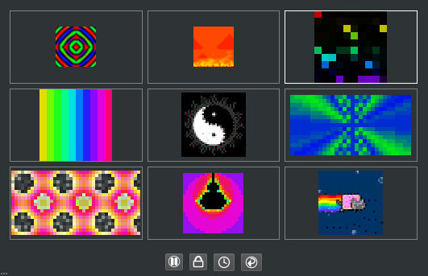

Main Window
===========

The main window provides all of the interactive functionality of PixelMaestro Studio. Here you can create animations, manage attached devices, and interact directly with the LED grid.

Layout
------

The main window is split into two sections: the *Renderer* and the *Editor*.

Renderer
^^^^^^^^

In the top-right corner of the screen is the renderer, which displays the current output from the Maestro. All of the Maestro's Sections are displayed in a grid (in order from left to right and top to bottom). The Section that currently has focus (called the *Active Section*) is shown with a white frame.

.. Note:: The Maestro Viewer may not be visible if *Main Window* is not selected as an output in the :doc:`Preferences <Preferences>` screen.

Control Buttons
~~~~~~~~~~~~~~~

Underneath the renderer are four buttons:

The *Lock Button* prevents any actions you perform from modifying the Maestro. While the Maestro is locked, the renderer is shown with a bright border to indicate changes won't affect the Maestro. Certain Maestro-level actions, such as enabling or disabling a :doc:`Show <Show-Tab>`, will remain unlocked.

.. Tip:: Performing an action while the Maestro is locked will still generate an :doc:`event <Show-Tab>`.

The *Play/Pause Button* controls the playback of the Maestro.

The *Sync Button* synchronizes any and all timer-based components including Animations, Canvas animations, and Shows, in order to prevent timers from drifting. This also synchronizes remote devices.

The *Refresh Button* refreshes the interface with the Maestro's current settings. This is used to update the UI after the Maestro is changed by a non-user initiated action (e.g. a Show). If an action causes the UI to go out of sync, this button appears highlighted.

Editor
^^^^^^

The rest of the main window contains various controls for interacting with the Maestro, starting with the Section editor.

Section Editor
--------------

The top-left corner of the window contains the Section editor, which lets you interact with and modify each of the Maestro's Sections and their Layers. Here, you can change settings such as the size, offset, scrolling behavior, and number of Layers for each Section.

.. image:: images/section-controls.png
    :target: images/section-controls.png
    :alt: Section editor

Selecting the Active Section
~~~~~~~~~~~~~~~~~~~~~~~~~~~~

PixelMaestro Studio can only modify one Section or Layer at a time. In order to edit a Section or Layer, you must first set it as the *Active Section*. To do this, open the *Section tab* select the Section that you want to modify. If you want to modify a Layer, open the *Layer tab* and do the same.

.. Note:: If the renderer is available, the Active Section will be shown with a white frame. You can also change the Active Section by clicking directly on the Section in the renderer.

Managing Layers
~~~~~~~~~~~~~~~

Layers let you run additional visuals on top of an existing Section. They are, in essence, a Section on top of a Section.

To add a Layer, click on the Layer tab and click the + button. This appends a new Layer to the end of the list. To remove the last Layer, click the - button.

Clicking on a Layer sets it as the Active Section. Because Layers are essentially Sections, they behave the same way as a normal Section would and can be modified using the same controls. To set the base Section as the Active Section, click "Base Section" in the Layer list.

*Mix Mode* determines how the Layer is rendered on top of the Section. The *Alpha* spin box controls the amount of blending between the Layer and the base Section, and is only available when the Alpha mix mode is selected. To learn more, read the PixelMaestro :pmdocs:`color mixing documentation <Colors.html#mixing-colors>`.

Changing Section Settings
~~~~~~~~~~~~~~~~~~~~~~~~~

Next to the Section list are the Section-related settings, which control the appearance and behavior of the Section or Layer.

*Size* changes the horizontal and vertical size of the Section in pixels.

.. Warning:: High resolutions can cause high CPU usage. If you're experiencing performance problems, try reducing the grid size.

*Scroll* scrolls the contents of the Section across the grid. The values indicate how much time (in milliseconds) it takes to complete a single scroll across either the horizontal or vertical axis. For example, a value of ``1000`` in the first text box means it will take 1000 milliseconds to scroll the Section once along the x axis. Setting either number negative reverses the direction of the scroll.

*Offset* shifts the Section the specified number of pixels along the x or y axis. This is disabled while *Scroll* is set.

*Mirror* mirrors the Section across the center of its x or y axis.

If *wrap* is checked, when the Section is scrolling or offset, Pixels that are moved off of the Section will reappear on the opposite side of the Section.

Brightness changes how bright or dim the Section appears. Brightness is a numeric value between 0 and 255, where 0 is completely dark and 255 is fully lit.

.. Tip:: You can control each Layer's brightness independently of its parent Section, but a Layer can only be as bright as its parent.

Other Editors
-------------

The bottom half of the main window contains the editor tab, which provides controls for interacting with the Maestro and performing other actions. It's split into four tabs:

* :doc:`Animation Tab <Animation-Tab>`
* :doc:`Canvas Tab <Canvas-Tab>`
* :doc:`Show Tab <Show-Tab>`
* :doc:`Device Tab <Device-Tab>`