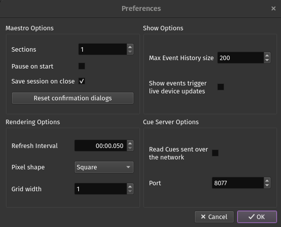

Preferences
===========

The Preferences dialog lets you change various options in PixelMaestro Studio.

To open the Preferences dialog, click *Edit* > *Preferences*.

Maestro Options
---------------

The *Maestro Options* control certain Maestro settings, as well as the behavior of PixelMaestro Studio.

Sections
^^^^^^^^

*Sections* sets the number of Sections assigned to the Maestro. Sections are displayed in the Maestro Viewer from left to right based on their index number.

.. Note:: This change will only take effect after opening a new Maestro or restarting PixelMaestro Studio.

Pause on Start
^^^^^^^^^^^^^^

When checked, *Pause on start* opens the Maestro in a paused state. This is useful if you want to create a Show from scratch and don't want the timer running in the background when you create or open a Maestro. You can resume playback at any time by clicking the play/pause button in the Maestro Editor.

Save Session on Close
^^^^^^^^^^^^^^^^^^^^^

*Save session on close* automatically saves your current Maestro configuration when you exit PixelMaestro Studio. The Maestro is automatically loaded the next time you open PixelMaestro Studio.

Reset confirmation dialogs
^^^^^^^^^^^^^^^^^^^^^^^^^^

Click *Reset confirmation dialogs* to unhide confirmation messages that had their "Do not show me this message" checkbox checked.

Rendering Options
-----------------

*Rendering Options* control how the Maestro is displayed in the Maestro Viewer.

Refresh Interval
^^^^^^^^^^^^^^^^

The *Refresh Interval* sets the amount of time (in milliseconds) between Maestro refreshes. A lower refresh interval provides smoother animations at the cost of increased CPU usage.

Pixel Shape
^^^^^^^^^^^

*Pixel shape* sets the shape of each individual pixel.

.. Tip:: For best performance, set the pixel shape to *Square*.

Grid Width
^^^^^^^^^^

The Maestro renderer displays all of the Maestro's Sections in a grid. *Grid width* sets the maximum number of Sections to display in each row.

.. Note:: You'll need to relaunch PixelMaestro Studio for this change to take effect.

Show Options
------------

*Show Options* control how Shows behave.

Max Event History Size
^^^^^^^^^^^^^^^^^^^^^^

*Max Event History Size* is the maximum number of events to display in the Event History.

Events Trigger Live Device Updates
^^^^^^^^^^^^^^^^^^^^^^^^^^^^^^^^^^

When enabled, any Show Events that run in the Maestro will trigger a :doc:`live update <Device-Tab>` for any connected devices that have live updates enabled. This is useful if you want to run a Show in PixelMaestro Studio and have your devices update without having to also run a Show on each device.

Cue Server Options
------------------

The *Cue Server* allows PixelMaestro Studio to receive Cues sent over the network.

Read Cues sent over the network
^^^^^^^^^^^^^^^^^^^^^^^^^^^^^^^

If checked, this starts the Cue Server.

Port
^^^^

Sets the port number for the Cue Server to listen on. By default, it uses port 8077.