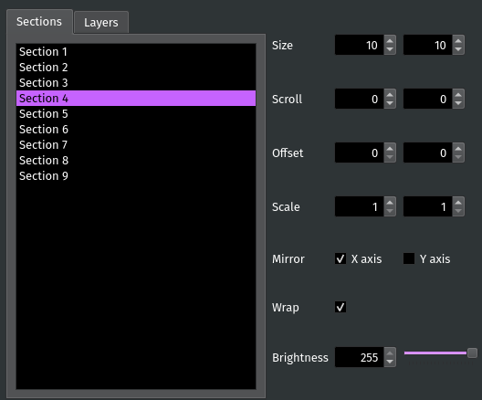

Section Tab
===========

The Section tab is where you set :pmdocs:`Section-specific <Sections.html>` settings such as the grid size, the number of Layers, and the scrolling speed.

Setting the Active Section
--------------------------

To edit a Section or Layer, you must first set it as the *Active Section*. Most actions performed in PixelMaestro Studio only affect the Active Section. If the Maestro is being displayed on screen, the Active Section will be shown with a white frame.

You can also set a Layer as the Active Section. In order to make a Layer active, you must first select its base Section in the *Active Section* drop-down menu. Then, select the Layer in the *Active Layer* drop-down. Active Layers are shown with a light gray frame.

For example, if ``Section 1`` is selected in the *Active Section* drop-down and *Base Section* is selected in the *Active Layer* drop-down, then any actions performed will affect the Section. If you select *Layer 1* in the *Active Layer* drop-down, then the Section's first Layer will become the Active Section.

Section Settings
----------------

Section settings change the behavior of the base Section.

The *Layers* text box changes the number of Layers belonging to the Section. You can switch between modifying the base Section and one of its Layers using the *Active Layer* drop-down.

Layer Settings
--------------

The *Active Layer* sets a Layer as the Active Section. Select *Base Section* to change the Active Section back to the Section itself.

*Mix Mode* specifies the method used to render the Layer onto the Section. The *Alpha* spin box controls the amount of blending between the Layer and the base Section, and is only available when the Alpha mix mode is selected.

General Settings
----------------

*Grid Size* changes the horizontal and vertical dimensions of the Section. Dimensions are measured in individual pixels. The new dimensions automatically apply to all other components belonging to the Active Section including Layers, Canvases, and Animations.

**Warning:** PixelMaestro is CPU dependent, and high resolutions can lead to excessive CPU usage. If you're having performance problems, try reducing the grid size.

*Scroll* scrolls the contents of the Section across the grid. The boxes correspond to the X and Y axes respectively and indicate how much time it takes to complete a single scroll (in milliseconds) across each axis. For example, a value of ``1000`` in the first box means it takes 1000 milliseconds to scroll the Section once along the x axis. Making either number negative reverses the direction of the scroll.

*Offset* shifts the Section the specified number of pixels along the X or Y axis. This is disabled while *Scroll* is set.

Brightness
----------

Brightness changes how bright or dim the Section appears. Brightness is a numeric value between 0 and 255, where 0 is completely dark and 255 is fully lit.

**Tip**\ : You can control each Layer's brightness independently of its parent Section, but a Layer can only be as bright as its parent.
