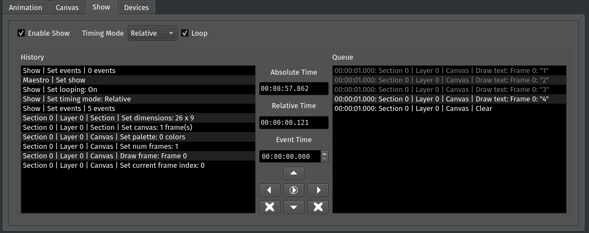

Show Tab
========

The :pmdocs:`Show <Shows.html>` tab lets you queue actions to run at a later point in the program's runtime.

Every action performed in PixelMaestro Studio generates an ``Event``\ , which appears in the *History*. You can give the Event an *Event Time* and schedule it in the *Queue*. When the runtime exceeds the Event's start time, the Event runs. Events that have already ran appear gray, while pending events appear white.

Selecting a Timing Mode
-----------------------

The *Timing Mode* determines how the Show tracks time. *Absolute Time* tracks the time elapsed since the Maestro was opened, and *Relative Time* tracks the time elapsed since the last Event ran. When relative time is enabled, checking *Loop Events* causes the Show to repeat after the last Event.

Modifying the Event Queue
-------------------------

.. Note:: Modifying the Event Queue will automatically update the Show. This also generates a new Event.

To add an Event to the Show, select one or more Events from the History. Enter the time you want the Event(s) to run in the *Event Time* box. As a convenience, the *Absolute Time* and *Relative Time* boxes show their respective elapsed times. Click the right arrow to add the Event(s) to the Event List.

To remove an Event from the Queue, select the Event(s) in the Queue and click the left arrow. To reorder the Queue, select the Event(s) that you want to move and click the up or down arrows.

To completely clear the History or Queue, click the **X** button closest to either list.
